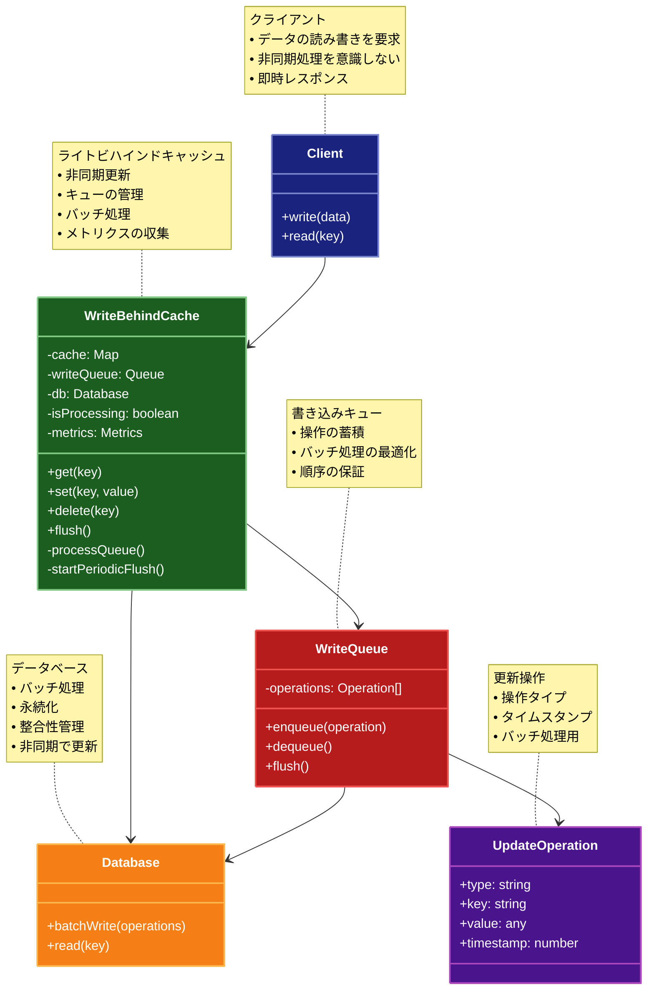

# Write-Behind（ライトビハインドキャッシュ）パターン

## 目的

データの書き込み時にキャッシュを即時更新し、永続化層への更新を非同期で行うことで、書き込みパフォーマンスを向上させアプリケーションのレスポンス性を高めるパターンです。

## 価値・解決する問題

- 書き込みパフォーマンスを向上させます
- システムの応答性を改善します
- データベースの負荷を軽減します
- バッチ処理による効率化を実現します
- レスポンス時間を短縮します
- リソースの効率的な利用を促進します
- 一時的なデータベース障害に対する耐性を向上させます

## 概要・特徴

### 概要

Write-Behindパターンは、データの書き込み時にまずキャッシュを更新し、その後非同期でデータベースに反映するパターンです。これにより、クライアントはデータベースの更新を待つことなく処理を続行でき、書き込み処理の応答時間を短縮し、データベースの負荷を軽減できます。このパターンは特に書き込み頻度の高いアプリケーションで効果的で、システム全体のスループットを向上させます。

### 特徴

#### 非同期データ永続化

データの書き込み要求を受け取ると、まずキャッシュを更新し、データベースへの書き込みは非同期で後から行います。これにより、クライアントはデータベース操作の完了を待つことなく処理を続行できるため、応答時間が大幅に短縮されます。例えば、ソーシャルメディアプラットフォームでは、ユーザーが投稿を送信した際に、投稿内容はまずキャッシュに保存され、バックグラウンドでデータベースに保存されるため、ユーザーはすぐに次のアクションに移れます。高トラフィックのウェブサイトやモバイルアプリケーションで特に効果的です。

#### バッチ処理による最適化

複数の書き込み操作をグループ化し、バッチとしてデータベースに適用することができます。これにより、データベース接続の回数が減少し、システム全体のパフォーマンスが向上します。例えば、ログ管理システムでは、個々のログエントリをその都度データベースに書き込むのではなく、一定数のエントリが蓄積されるか、一定時間が経過した時点でまとめて永続化することで、I/O操作を最小限に抑え、効率的なリソース利用が可能になります。これはデータベース接続数に制限があるシステムや、書き込みコストが高いデータベースで特に有用です。

#### キューイングメカニズム

書き込み操作はキューに格納され、順次または最適なタイミングでデータベースに適用されます。これにより、データベースの一時的な過負荷や障害時にも書き込み要求を失うことなく処理を継続できます。例えば、大規模なデータ収集システムでは、センサーからのデータがキャッシュに保存され、キューに格納されて順次データベースに書き込まれるため、データベースのメンテナンスや一時的な障害があっても、データ損失なく運用を継続できます。このキューイングメカニズムはシステムの回復力を高め、耐障害性を向上させます。

#### 一時的な不整合の許容

キャッシュとデータベースの間に一時的な不整合が生じる可能性がありますが、最終的には一貫性が保証されます（結果整合性）。これは厳密な一貫性よりもパフォーマンスと可用性を優先するシステムに適しています。例えば、オンラインショッピングの「いいね」機能やビュー数カウンターなど、多少の遅延や一時的な不一致が許容される機能に適しています。ただし、銀行取引などの即時の一貫性が要求される場面では注意が必要です。

#### 書き込みコリージョン対策

同じデータに対する複数の更新が非同期で行われる場合、データ競合が発生する可能性があります。このパターンでは、バージョン管理や最終更新時刻のチェックなどの方法でこれらの競合を検出し解決するメカニズムを備えています。例えば、共同編集ドキュメントシステムでは、複数ユーザーが同時に編集する際に発生する可能性のある競合を、タイムスタンプや操作の順序付けによって解決し、データの整合性を維持します。これにより、並行処理環境でも安全なデータ更新が可能になります。

### 概要図



## 類似パターンとの比較

- [Write-Through (ライトスルー)](write-through.md): Write-Behind は非同期で更新を行い、これに対して Write-Through は同期的に更新を行います。
- [Write-Around (ライトアラウンド)](write-around.md): Write-Behind はキャッシュを更新し、これに対して Write-Around はキャッシュをバイパスします。
- [Cache-Aside (キャッシュアサイド)](cache-aside.md): Write-Behind はキャッシュを主体として管理し、これに対して Cache-Aside はキャッシュと永続化層を独立して管理します。
- [Read-Through Cache (リードスルーキャッシュ)](read-through.md): Write-Behind Cache は書き込み時のキャッシュ管理を行い、これに対して Read-Through Cache は読み取り時のキャッシュ管理を行います。

## 利用されているライブラリ／フレームワークの事例

- [Redis](https://redis.io/docs/manual/persistence/): AOF永続化
- [Hibernate](https://hibernate.org/): 遅延書き込み機能
- [Apache Cassandra](https://cassandra.apache.org/): 非同期書き込み
- [EhCache](https://www.ehcache.org/): Java用のキャッシュライブラリ
- [NCache](https://www.alachisoft.com/ncache/): .NET用の分散キャッシュ

## 解説ページリンク

- [Microsoft - Write-Behind Pattern](https://docs.microsoft.com/en-us/azure/architecture/patterns/write-behind)
- [AWS - Amazon ElastiCache](https://aws.amazon.com/elasticache/redis/)
- [Redis Persistence](https://redis.io/topics/persistence)
- [Microsoft Cloud Design Patterns: Cache-Aside](https://docs.microsoft.com/en-us/azure/architecture/patterns/cache-aside)
- [AWS: Caching Overview](https://aws.amazon.com/caching/)

## コード例

### Before:

同期的な書き込みを行う実装

```typescript
class UserService {
  private db: Map<string, any>;

  constructor() {
    this.db = new Map([
      ["1", { id: "1", name: "John Doe", email: "john@example.com" }],
      ["2", { id: "2", name: "Jane Smith", email: "jane@example.com" }]
    ]);
  }

  async getUser(id: string): Promise<any> {
    // データベースアクセスを遅延させる
    await new Promise(resolve => setTimeout(resolve, 100));

    const user = this.db.get(id);
    if (!user) {
      throw new Error("User not found");
    }
    return user;
  }

  async updateUser(id: string, data: any): Promise<any> {
    // データベースアクセスを遅延させる
    await new Promise(resolve => setTimeout(resolve, 100));

    if (!this.db.has(id)) {
      throw new Error("User not found");
    }
    const updatedUser = { ...this.db.get(id), ...data };
    this.db.set(id, updatedUser);
    return updatedUser;
  }
}

// 使用例
async function example() {
  const service = new UserService();

  try {
    const user = await service.getUser("1");
    console.log("取得したユーザー:", user);

    const updatedUser = await service.updateUser("1", { name: "John Updated" });
    console.log("更新後のユーザー:", updatedUser);
  } catch (error) {
    console.error("エラー:", error);
  }
}

example();
```

### After:

Write-Behindパターンを適用した実装

```typescript
// ユーザーを表すドメインモデル
interface User {
  id: string;
  name: string;
  email: string;
  lastUpdated: Date;
}

// キャッシュインターフェース
interface Cache<T> {
  get(key: string): Promise<T | undefined>;
  set(key: string, value: T): Promise<void>;
  delete(key: string): Promise<void>;
  clear(): Promise<void>;
}

// 永続化層インターフェース
interface DataStore<T> {
  read(key: string): Promise<T | null>;
  write(key: string, value: T): Promise<void>;
  delete(key: string): Promise<void>;
  batchWrite(operations: Array<{ key: string; value: T }>): Promise<void>;
  batchDelete(keys: string[]): Promise<void>;
}

// 更新操作の型定義
type UpdateOperation<T> = {
  type: 'write' | 'delete';
  key: string;
  value?: T;
  timestamp: number;
};

// インメモリキャッシュの実装
class InMemoryCache<T> implements Cache<T> {
  private cache: Map<string, T> = new Map();

  async get(key: string): Promise<T | undefined> {
    return this.cache.get(key);
  }

  async set(key: string, value: T): Promise<void> {
    this.cache.set(key, value);
  }

  async delete(key: string): Promise<void> {
    this.cache.delete(key);
  }

  async clear(): Promise<void> {
    this.cache.clear();
  }
}

// 書き込みキューを管理するクラス
class WriteQueue<T> {
  private queue: Map<string, UpdateOperation<T>> = new Map();

  // 操作をキューに追加
  enqueue(operation: UpdateOperation<T>): void {
    this.queue.set(operation.key, operation);
    console.log(`キューに追加: ${operation.type} ${operation.key}`);
  }

  // キューからすべての操作を取得して削除
  dequeue(): UpdateOperation<T>[] {
    if (this.queue.size === 0) {
      return [];
    }

    const operations = Array.from(this.queue.values());
    this.queue.clear();
    return operations;
  }

  // キューのサイズを取得
  get size(): number {
    return this.queue.size;
  }
}

// Write-Behind Cacheの実装
class WriteBehindCache<T> {
  private writeQueue: WriteQueue<T>;
  private isProcessing: boolean = false;
  private flushInterval: number;
  private metrics = {
    cacheHits: 0,
    cacheMisses: 0,
    pendingWrites: 0,
    completedWrites: 0,
    failedWrites: 0
  };

  constructor(
    private cache: Cache<T>,
    private store: DataStore<T>,
    private batchSize: number = 10,
    flushIntervalMs: number = 5000
  ) {
    this.writeQueue = new WriteQueue<T>();
    this.flushInterval = flushIntervalMs;
    this.startPeriodicFlush();
  }

  // 定期的なフラッシュを開始
  private startPeriodicFlush(): void {
    setInterval(() => this.flush(), this.flushInterval);
  }

  // データの取得
  async get(key: string): Promise<T | null> {
    // 1. キャッシュをチェック
    const cachedValue = await this.cache.get(key);
    if (cachedValue !== undefined) {
      this.metrics.cacheHits++;
      console.log(`キャッシュヒット: ${key}`);
      return cachedValue;
    }

    this.metrics.cacheMisses++;
    console.log(`キャッシュミス: ${key}`);

    // 2. キャッシュミスの場合、データストアから取得
    const value = await this.store.read(key);
    
    // 3. 取得したデータをキャッシュに格納（nullでない場合）
    if (value !== null) {
      await this.cache.set(key, value);
    }
    
    return value;
  }

  // データの設定（キャッシュを即時更新し、データストアへの更新を遅延）
  async set(key: string, value: T): Promise<void> {
    console.log(`キャッシュに書き込み: ${key}`);
    
    // 1. キャッシュを即時更新
    await this.cache.set(key, value);
    
    // 2. 更新操作をキューに追加
    this.writeQueue.enqueue({
      type: 'write',
      key,
      value,
      timestamp: Date.now()
    });
    
    this.metrics.pendingWrites++;
  }

  // データの削除
  async delete(key: string): Promise<void> {
    console.log(`キャッシュから削除: ${key}`);
    
    // 1. キャッシュから即時削除
    await this.cache.delete(key);
    
    // 2. 削除操作をキューに追加
    this.writeQueue.enqueue({
      type: 'delete',
      key,
      timestamp: Date.now()
    });
    
    this.metrics.pendingWrites++;
  }

  // 書き込みキューを強制的にフラッシュ
  async flush(): Promise<void> {
    if (this.isProcessing || this.writeQueue.size === 0) {
      return;
    }

    try {
      this.isProcessing = true;
      console.log('キューのフラッシュを開始');
      
      // キューから操作を取得
      const operations = this.writeQueue.dequeue();
      
      // 書き込みと削除操作に分類
      const writes: Array<{ key: string; value: T }> = [];
      const deletes: string[] = [];
      
      operations.forEach(op => {
        if (op.type === 'write' && op.value) {
          writes.push({ key: op.key, value: op.value });
        } else if (op.type === 'delete') {
          deletes.push(op.key);
        }
      });
      
      // バッチ書き込みの実行
      if (writes.length > 0) {
        await this.store.batchWrite(writes);
        this.metrics.completedWrites += writes.length;
        console.log(`${writes.length}件のデータを書き込みました`);
      }
      
      // バッチ削除の実行
      if (deletes.length > 0) {
        await this.store.batchDelete(deletes);
        this.metrics.completedWrites += deletes.length;
        console.log(`${deletes.length}件のデータを削除しました`);
      }
      
    } catch (error) {
      console.error('フラッシュ中にエラーが発生しました:', error);
      this.metrics.failedWrites += this.writeQueue.size;
    } finally {
      this.isProcessing = false;
    }
  }

  // メトリクスの取得
  getMetrics(): typeof this.metrics {
    return { ...this.metrics };
  }
}

// モック用のデータストア実装
class MockDataStore<T> implements DataStore<T> {
  private data: Map<string, T> = new Map();
  
  async read(key: string): Promise<T | null> {
    console.log(`DB読み取り: ${key}`);
    // 読み取り遅延をシミュレート
    await new Promise(resolve => setTimeout(resolve, 100));
    return this.data.get(key) || null;
  }
  
  async write(key: string, value: T): Promise<void> {
    console.log(`DB書き込み: ${key}`);
    // 書き込み遅延をシミュレート
    await new Promise(resolve => setTimeout(resolve, 100));
    this.data.set(key, value);
  }
  
  async delete(key: string): Promise<void> {
    console.log(`DB削除: ${key}`);
    // 削除遅延をシミュレート
    await new Promise(resolve => setTimeout(resolve, 100));
    this.data.delete(key);
  }
  
  async batchWrite(operations: Array<{ key: string; value: T }>): Promise<void> {
    console.log(`バッチ書き込み: ${operations.length}件`);
    // バッチ書き込み遅延をシミュレート
    await new Promise(resolve => setTimeout(resolve, 200));
    operations.forEach(op => this.data.set(op.key, op.value));
  }
  
  async batchDelete(keys: string[]): Promise<void> {
    console.log(`バッチ削除: ${keys.length}件`);
    // バッチ削除遅延をシミュレート
    await new Promise(resolve => setTimeout(resolve, 200));
    keys.forEach(key => this.data.delete(key));
  }
}

// 使用例
async function example() {
  // キャッシュとデータストアの作成
  const cache = new InMemoryCache<User>();
  const dataStore = new MockDataStore<User>();
  
  // 初期データの設定
  await dataStore.write("1", { 
    id: "1", 
    name: "John Doe", 
    email: "john@example.com",
    lastUpdated: new Date()
  });
  
  // Write-Behindキャッシュの作成（1秒間隔でフラッシュ）
  const writeBehindCache = new WriteBehindCache<User>(cache, dataStore, 10, 1000);
  
  // 1. データの書き込み（即時キャッシュ更新、遅延DB更新）
  console.log("=== データの書き込み ===");
  await writeBehindCache.set("2", {
    id: "2",
    name: "Jane Smith",
    email: "jane@example.com",
    lastUpdated: new Date()
  });
  
  // 2. 初回のデータ読み取り（キャッシュミス→DBから取得→キャッシュ更新）
  console.log("\n=== 初回のデータ読み込み (キャッシュミス) ===");
  const user1 = await writeBehindCache.get("1");
  console.log("ユーザー1:", user1);
  
  // 3. 2回目のデータ読み取り（キャッシュヒット）
  console.log("\n=== 2回目のデータ読み込み (キャッシュヒット) ===");
  const cachedUser1 = await writeBehindCache.get("1");
  console.log("ユーザー1 (キャッシュから):", cachedUser1);
  
  // 4. 書き込んだデータの即時読み取り（キャッシュには既にある）
  console.log("\n=== 書き込んだデータの読み込み (キャッシュにある) ===");
  const user2 = await writeBehindCache.get("2");
  console.log("ユーザー2:", user2);
  
  // 5. 多数のデータ書き込み（後でバッチ処理される）
  console.log("\n=== 複数データの書き込み ===");
  for (let i = 3; i <= 10; i++) {
    await writeBehindCache.set(`${i}`, {
      id: `${i}`,
      name: `User ${i}`,
      email: `user${i}@example.com`,
      lastUpdated: new Date()
    });
  }
  
  // 6. 強制的なフラッシュ（通常は定期的に自動実行される）
  console.log("\n=== 書き込みキューの手動フラッシュ ===");
  await writeBehindCache.flush();
  
  // 7. メトリクスの取得
  console.log("\n=== メトリクス ===");
  console.log(writeBehindCache.getMetrics());
  
  // 8. データの削除とフラッシュ
  console.log("\n=== データの削除 ===");
  await writeBehindCache.delete("1");
  await writeBehindCache.flush();
  
  // 9. 削除後の確認
  console.log("\n=== 削除したデータの確認 ===");
  const deletedUser = await writeBehindCache.get("1");
  console.log("削除されたユーザー:", deletedUser);
}

example();
``` 