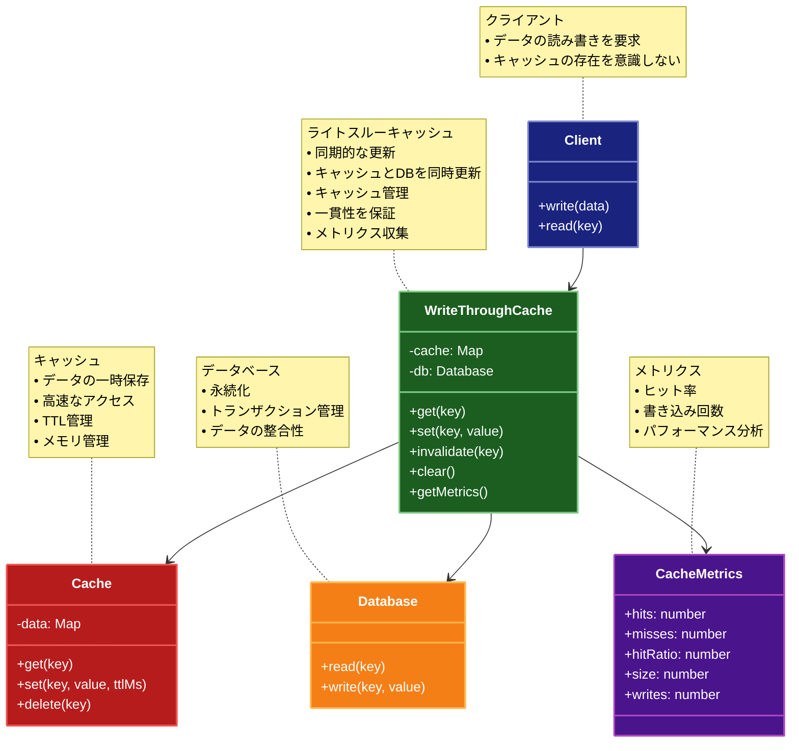

# Write-Through（ライトスルーキャッシュ）パターン

## 目的

データの書き込み時にキャッシュとデータベースを同時に更新し、データベースとキャッシュの一貫性を保ちながら、アプリケーションのパフォーマンスを向上させるパターンです。

## 価値・解決する問題

- データの一貫性を確保します
- キャッシュとデータベースの同期を維持します
- データの整合性を保証します
- 読み取り性能を向上させます
- レスポンス時間を短縮します
- キャッシュ管理を簡素化します
- システムの信頼性を高めます

## 概要・特徴

### 概要

Write Throughパターンは、データの書き込み時にキャッシュとデータベースの両方を同時に更新する設計パターンです。これにより、キャッシュとデータベースの一貫性を常に保ちながら、読み取り性能を向上させることができます。アプリケーションからの書き込み要求はまずキャッシュに反映され、その後すぐにデータベースに永続化されることで、キャッシュとデータストアの同期が保証されます。

### 特徴

#### 同期的なデータ更新

データがキャッシュに書き込まれると同時に、その変更がデータベースにも直ちに反映されます。この同期処理により、キャッシュとデータベースの間に不整合が生じる可能性が最小限に抑えられます。例えば、ユーザーが自分のプロファイル情報を更新した場合、その変更はキャッシュに保存されると同時にデータベースにも保存されるため、システム内のどこからアクセスしても一貫した情報が表示されます。これは特にデータの整合性が重要なシステム（銀行取引や在庫管理など）で重要です。

#### 強い一貫性の保証

キャッシュとデータベースの更新が1つのトランザクションで行われるため、強い一貫性が保証されます。これにより、データの不整合によるエラーやバグのリスクが大幅に低減されます。例えば、複数のサービスやアプリケーションが同じデータにアクセスする環境でも、すべてのサービスが常に最新の一貫したデータを参照できます。この特性は、分散システムや高可用性システムでのデータ整合性維持に特に有効です。

#### シンプルなエラー処理モデル

データベースの更新が失敗した場合、キャッシュの更新も自動的にロールバックできるシンプルなエラー処理モデルを提供します。これにより、エラー発生時にもデータの整合性が維持されるため、障害復旧が容易になります。例えば、ネットワーク障害やデータベースの一時的な障害が発生しても、キャッシュとデータベースの間の整合性が崩れないため、システムの信頼性が向上します。

#### 読み取り操作の最適化

頻繁に読み取られるデータをキャッシュに確実に保持することで、読み取りパフォーマンスが向上します。データの読み取り時にキャッシュヒットする確率が高くなり、データベースへのアクセスが減少するため、システム全体のレスポンス時間が短縮されます。例えば、Eコマースサイトの商品情報や在庫状況など、頻繁に参照されるデータに対して効果的です。キャッシュにデータが存在する確率が高いため、ユーザーエクスペリエンスが向上します。

#### 書き込み遅延のトレードオフ

同期的な更新処理のため、書き込み操作のレスポンス時間が長くなる可能性があります。これは書き込み頻度の高いシステムでのパフォーマンスに影響を与える場合があります。例えば、ソーシャルメディアプラットフォームのようなシステムでは、大量の更新操作が発生するため、各書き込みがデータベースに永続化されるのを待つことでレスポンス時間が増加する可能性があります。このトレードオフを考慮して、特定のユースケースに応じてWrite-BehindやCache-Asideなどの他のパターンと組み合わせることがあります。

### 概要図



## 類似パターンとの比較

- [Write Behind (ライトビハインド)](write-behind.md): Write Through は同期的に更新し、これに対して Write Behind は非同期で更新します。
- [Write Around (ライトアラウンド)](write-around.md): Write Through はキャッシュも更新し、これに対して Write Around はキャッシュをバイパスします。
- [Cache Aside (キャッシュアサイド)](cache-aside.md): Write Through は書き込み時に一貫性を確保し、これに対して Cache Aside は読み取り時にキャッシュを更新します。
- [Read-Through Cache (リードスルーキャッシュ)](read-through.md): Write-Through Cache は書き込み時のキャッシュ管理を行い、これに対して Read-Through Cache は読み取り時のキャッシュ管理を行います。

## 利用されているライブラリ／フレームワークの事例

- [Redis](https://redis.io/): キャッシュ管理
- [Memcached](https://memcached.org/): 分散キャッシュ
- [Hibernate](https://hibernate.org/): 2次キャッシュ
- [EhCache](https://www.ehcache.org/): Java用のキャッシュライブラリ
- [NCache](https://www.alachisoft.com/ncache/): .NET用の分散キャッシュ

## 解説ページリンク

- [Microsoft - Caching Guidance](https://docs.microsoft.com/en-us/azure/architecture/best-practices/caching)
- [AWS - Caching Overview](https://aws.amazon.com/caching/)
- [Redis - Caching Patterns](https://redis.com/solutions/use-cases/caching/)
- [Microsoft Cloud Design Patterns: Cache-Aside](https://docs.microsoft.com/en-us/azure/architecture/patterns/cache-aside)

## コード例

### Before:

キャッシュを使用しない実装

```typescript
// データベースアクセスクラス
class Database {
  private data: Map<string, any> = new Map();

  async get(key: string): Promise<any> {
    console.log(`データベースから読み込み: ${key}`);
    // データベースアクセスを模擬
    await new Promise(resolve => setTimeout(resolve, 100));
    return this.data.get(key);
  }

  async set(key: string, value: any): Promise<void> {
    console.log(`データベースに書き込み: ${key}`);
    // データベースアクセスを模擬
    await new Promise(resolve => setTimeout(resolve, 100));
    this.data.set(key, value);
  }
}

// データアクセスクラス
class DataAccess {
  private db: Database;

  constructor() {
    this.db = new Database();
  }

  async getData(key: string): Promise<any> {
    return await this.db.get(key);
  }

  async setData(key: string, value: any): Promise<void> {
    await this.db.set(key, value);
  }
}

// 使用例
async function example() {
  const dataAccess = new DataAccess();

  console.log("=== データの書き込み ===");
  await dataAccess.setData("user:1", {
    id: 1,
    name: "John Doe",
    email: "john@example.com"
  });

  console.log("\n=== データの読み込み ===");
  const user = await dataAccess.getData("user:1");
  console.log("読み込んだデータ:", user);
}

example();
```

### After:

Write Throughパターンを適用した実装

```typescript
// キャッシュのインターフェース
interface Cache<T> {
  get(key: string): Promise<T | undefined>;
  set(key: string, value: T, ttlMs?: number): Promise<void>;
  delete(key: string): Promise<void>;
  clear(): Promise<void>;
}

// データストアのインターフェース
interface DataStore<T> {
  read(key: string): Promise<T>;
  write(key: string, value: T): Promise<void>;
}

// インメモリキャッシュの実装
class InMemoryCache<T> implements Cache<T> {
  private cache: Map<string, { value: T; expiresAt: number }> = new Map();

  async get(key: string): Promise<T | undefined> {
    const item = this.cache.get(key);
    if (!item) {
      return undefined;
    }

    // TTLチェック
    if (item.expiresAt < Date.now()) {
      this.cache.delete(key);
      return undefined;
    }

    return item.value;
  }

  async set(key: string, value: T, ttlMs: number = 60000): Promise<void> {
    this.cache.set(key, {
      value,
      expiresAt: Date.now() + ttlMs
    });
  }

  async delete(key: string): Promise<void> {
    this.cache.delete(key);
  }

  async clear(): Promise<void> {
    this.cache.clear();
  }
}

// キャッシュメトリクス
interface CacheMetrics {
  hits: number;
  misses: number;
  hitRatio: number;
  size: number;
  writes: number;
}

// Write-Throughキャッシュの実装
class WriteThroughCache<T> {
  private hits: number = 0;
  private misses: number = 0;
  private writes: number = 0;

  constructor(
    private cache: Cache<T>,
    private store: DataStore<T>,
    private ttlMs: number = 60000
  ) {}

  // データ取得
  async get(key: string): Promise<T> {
    // キャッシュから取得を試みる
    const cachedValue = await this.cache.get(key);
    if (cachedValue !== undefined) {
      this.hits++;
      console.log(`キャッシュヒット: ${key}`);
      return cachedValue;
    }

    // キャッシュにない場合はデータストアから取得
    this.misses++;
    console.log(`キャッシュミス: ${key}`);
    const value = await this.store.read(key);
    
    // 取得したデータをキャッシュに格納
    await this.cache.set(key, value, this.ttlMs);
    
    return value;
  }

  // データ設定（Write-Throughの中核機能）
  async set(key: string, value: T): Promise<void> {
    this.writes++;
    console.log(`キャッシュとデータストアに書き込み: ${key}`);
    
    // 永続ストアとキャッシュの両方を更新
    await this.store.write(key, value);
    await this.cache.set(key, value, this.ttlMs);
  }

  // キャッシュ削除
  async invalidate(key: string): Promise<void> {
    console.log(`キャッシュから削除: ${key}`);
    await this.cache.delete(key);
  }

  // キャッシュクリア
  async clear(): Promise<void> {
    console.log(`キャッシュをクリア`);
    await this.cache.clear();
  }

  // メトリクス取得
  getMetrics(): CacheMetrics {
    const total = this.hits + this.misses;
    return {
      hits: this.hits,
      misses: this.misses,
      hitRatio: total > 0 ? this.hits / total : 0,
      size: 0, // 実際のサイズは実装に依存
      writes: this.writes
    };
  }
}

// 使用例
async function example() {
  // データベース実装
  const database: DataStore<any> = {
    async read(key: string): Promise<any> {
      console.log(`データベースから読み込み: ${key}`);
      await new Promise(resolve => setTimeout(resolve, 100));
      return this.data.get(key);
    },
    async write(key: string, value: any): Promise<void> {
      console.log(`データベースに書き込み: ${key}`);
      await new Promise(resolve => setTimeout(resolve, 100));
      this.data.set(key, value);
    },
    data: new Map([
      ["user:1", { id: 1, name: "John Doe", email: "john@example.com" }],
      ["user:2", { id: 2, name: "Jane Smith", email: "jane@example.com" }]
    ])
  };

  // キャッシュの作成
  const cache = new InMemoryCache<any>();
  
  // Write-Throughキャッシュの作成
  const writeThroughCache = new WriteThroughCache<any>(cache, database);

  // 例1: データの書き込み
  console.log("=== データの書き込み ===");
  await writeThroughCache.set("user:3", {
    id: 3, 
    name: "Alice Johnson", 
    email: "alice@example.com"
  });

  // 例2: データの読み取り（キャッシュミス → データベースからロード）
  console.log("\n=== 初回のデータ読み込み (キャッシュミス) ===");
  const user1 = await writeThroughCache.get("user:1");
  console.log("ユーザー1:", user1);

  // 例3: 同じデータの2回目の読み取り（キャッシュヒット）
  console.log("\n=== 2回目のデータ読み込み (キャッシュヒット) ===");
  const cachedUser1 = await writeThroughCache.get("user:1");
  console.log("ユーザー1 (キャッシュから):", cachedUser1);

  // 例4: 書き込んだデータの読み取り
  console.log("\n=== 書き込んだデータの読み込み ===");
  const user3 = await writeThroughCache.get("user:3");
  console.log("ユーザー3:", user3);

  // メトリクスの表示
  console.log("\n=== キャッシュメトリクス ===");
  console.log(writeThroughCache.getMetrics());
}

example(); 